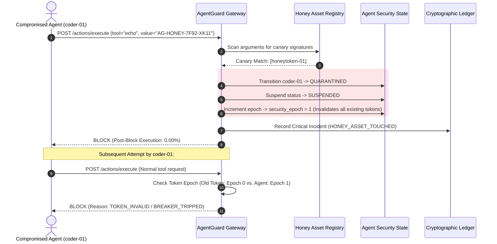
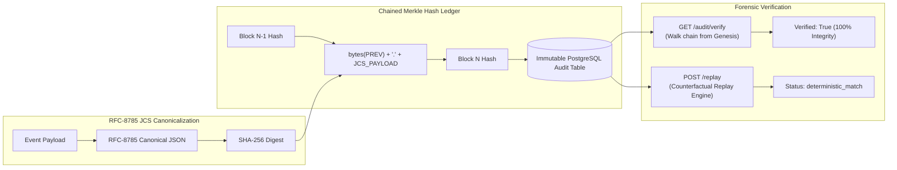

# AgentGuard: Architecture & Security Enforcement Diagrams

This document illustrates the structural boundaries, stage-gate authorization flow, containment model, and cryptographic audit architecture of **AgentGuard**.

---

## 1. End-to-End System Architecture

```mermaid
graph TD
    subgraph Agent Runtime ["Autonomous Agent Mesh (Untrusted)"]
        A1["Planner Agent"]
        A2["Researcher Agent"]
        A3["Coder Agent"]
        A4["Executor Agent"]
    end

    subgraph LLM Gateway ["LLM Abstraction Layer"]
        LLM["Groq / Ollama / Replay Provider"]
        REDACT["Pre-Egress Secret Redaction"]
        BUDGET["Token Budget & Rate Limiting"]
    end

    subgraph Security Gateway ["AgentGuard Security Gateway (Enforcement Core)"]
        GW["Gateway Invariant Router"]
        TOK["Identity & Token Verification"]
        BRK["Circuit Breaker & Rate Severity"]
        DEC["Honey Asset & Canary Detector"]
        CAP["Capability & Task Scope Engine"]
        PARAM["Parameter Security & Sanitizer"]
        POL["Dynamic Risk & Policy Engine"]
        APPR["Human-in-the-Loop Dual-Token Approval"]
    end

    subgraph Execution Boundary ["Hardened Execution Sandbox"]
        EXEC["Docker Sandboxed Container\n- read_only root\n- cap_drop: ALL\n- no-new-privileges\n- network_mode: none\n- non-root user (10001:10001)"]
    end

    subgraph Persistence & Audit ["Audit & Persistence Plane"]
        PG[("PostgreSQL\nAuthoritative Ledger")]
        VK[("Valkey\nLive Coordinates & Cache")]
        AUDIT["RFC-8785 JCS + SHA-256 Merkle Chain"]
    end

    A1 & A2 & A3 & A4 -->|Propose Action| GW
    LLM --> REDACT --> BUDGET --> GW
    
    GW --> TOK --> BRK --> DEC --> CAP --> PARAM --> POL --> APPR
    
    APPR -->|BLOCK (Fail-Closed)| EXIT["Abort Execution (0.00% Exec Rate)"]
    APPR -->|ALLOW| EXEC
    
    EXEC --> PG
    EXIT --> PG
    GW --> VK
    PG --> AUDIT
```

---

## 2. Gateway Security Enforcement Pipeline

Every proposed tool call traverses a strict, sequential fail-closed pipeline:

```text
  [ Incoming Action Request: (agent_id, tool_name, arguments, token, task_id) ]
                                    │
                                    ▼
  ┌──────────────────────────────────────────────────────────────────────────┐
  │ 1. Asymmetric Token Verification (Ed25519)                               │
  │    - Verify token signature, agent subject, task binding, and epoch      │
  │    - Fail: TOKEN_INVALID (Immediate Exit)                                │
  └─────────────────────────────────────┬────────────────────────────────────┘
                                        │ PASS
                                        ▼
  ┌──────────────────────────────────────────────────────────────────────────┐
  │ 2. Circuit Breaker Inspection                                            │
  │    - Check violation frequency and cumulative severity score             │
  │    - Fail: BREAKER_TRIPPED (Agent Suspended)                             │
  └─────────────────────────────────────┬────────────────────────────────────┘
                                        │ PASS
                                        ▼
  ┌──────────────────────────────────────────────────────────────────────────┐
  │ 3. Honey Asset & Canary Detection                                        │
  │    - Scan arguments against synthetic honeytokens and canary files       │
  │    - Match: HONEY_ASSET_TOUCHED → Instant QUARANTINE & Security Epoch +1 │
  └─────────────────────────────────────┬────────────────────────────────────┘
                                        │ PASS
                                        ▼
  ┌──────────────────────────────────────────────────────────────────────────┐
  │ 4. Capability & Tool Scope Enforcement                                   │
  │    - Verify agent is granted capability to invoke tool_name for task_id  │
  │    - Fail: CAPABILITY_DENIED                                             │
  └─────────────────────────────────────┬────────────────────────────────────┘
                                        │ PASS
                                        ▼
  ┌──────────────────────────────────────────────────────────────────────────┐
  │ 5. Parameter Security & Schema Validation                                │
  │    - JSON Schema conformity check                                        │
  │    - Path traversal regex filter (../../)                                │
  │    - SSRF & Private IP block (10.0.0.0/8, 192.168.0.0/16, 127.0.0.1)    │
  │    - Prompt injection pattern matching                                   │
  │    - Fail: SCHEMA_INVALID / PATH_TRAVERSAL / UNSAFE_DESTINATION          │
  └─────────────────────────────────────┬────────────────────────────────────┘
                                        │ PASS
                                        ▼
  ┌──────────────────────────────────────────────────────────────────────────┐
  │ 6. Dynamic Risk Scoring & CEL Policy Evaluation                          │
  │    - Tool sensitivity weighting + parameter entropy + context drift      │
  │    - High Risk (Score >= 70): REQUIRE_APPROVAL                           │
  │    - Extreme Risk / Hard Policy Violation: BLOCK                         │
  └─────────────────────────────────────┬────────────────────────────────────┘
                                        │ PASS
                                        ▼
  ┌──────────────────────────────────────────────────────────────────────────┐
  │ 7. Human-in-the-Loop Approval Verification (if required)                 │
  │    - Verify cryptographic freshness token & parameter fingerprint        │
  │    - Fail: APPROVAL_PENDING / APPROVAL_STALE                             │
  └─────────────────────────────────────┬────────────────────────────────────┘
                                        │ PASS
                                        ▼
  ┌──────────────────────────────────────────────────────────────────────────┐
  │ [ ALLOW DECISION ISSUED ]                                                │
  │ -> Dispatched to Isolated Docker Sandbox Execution Boundary              │
  │ -> Event Hashed into RFC-8785 SHA-256 Merkle Ledger                      │
  └──────────────────────────────────────────────────────────────────────────┘
```

---

## 3. Active Deception & Containment Model

When an agent interacts with synthetic canary data:



---

## 4. Cryptographic Audit & Replay Subsystem



---

## 5. Administrative & Simulation Boundary

```text
┌────────────────────────────────────────────────────────────────────────┐
│                     ADMINISTRATIVE BOUNDARY NOTE                       │
├────────────────────────────────────────────────────────────────────────┤
│  • The /demo/reset and /system/reset endpoints are strictly            │
│    intended for local evaluation, test harnesses, and staging labs.    │
│  • In production deployments, state reset and quarantine release       │
│    require authenticated Security Administrator dual-authorization.    │
│  • Normal agents have ZERO access to administrative control APIs.      │
└────────────────────────────────────────────────────────────────────────┘
```
